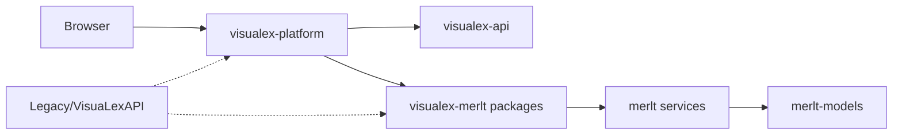
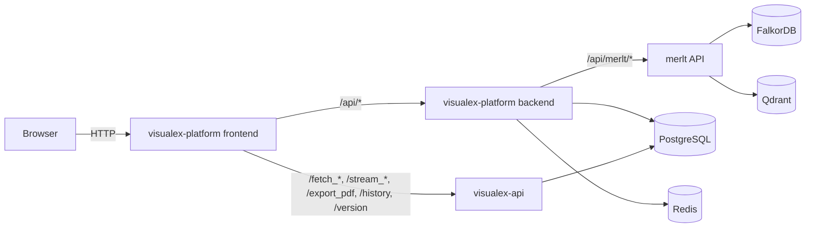
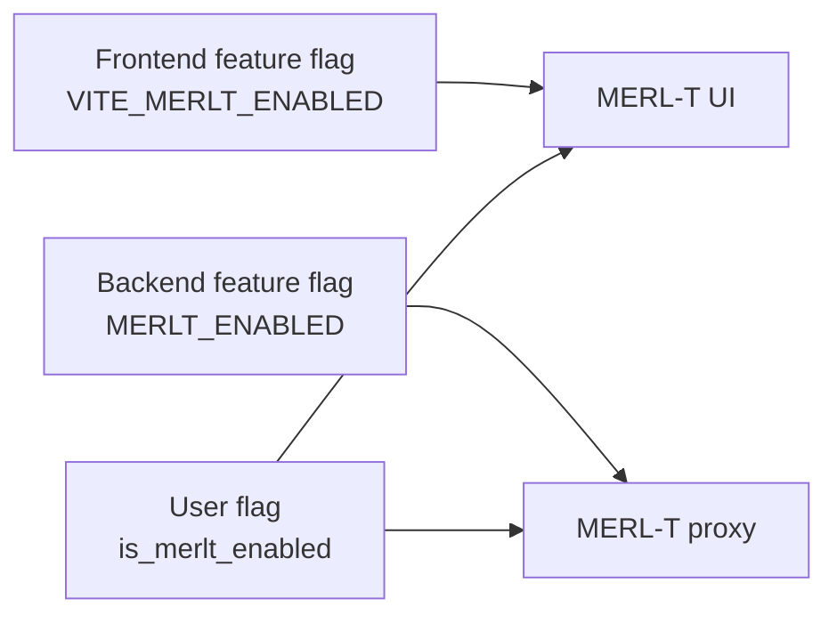

# VisuaLex Repository Overview

This document summarizes the current repo layout and how the pieces fit together.
It is meant as a high-level map for maintenance and onboarding.

## Top-Level Repositories

- `visualex-platform`  
  Main app (frontend + backend). Vanilla by default; MERL‑T features are gated.
- `visualex-api`  
  Python API (scrapers + article data).
- `visualex-merlt`  
  MERL‑T frontend and backend packages (consumed by `visualex-platform`).
- `merlt`  
  MERL‑T backend services (KG/RLCF).
- `merlt-models`  
  Model checkpoints and configs used by MERL‑T.
- `Legacy/VisuaLexAPI`  
  Legacy monolith reference (full, mixed system).

## Structure Diagram

## Runtime Routes + Databases

## MERL-T Feature Gating

## Runtime Modes (Dev)

- **Vanilla**
  - `visualex-platform` runs the UI + backend.
  - `visualex-api` runs as Python API.
  - MERL‑T UI/flows are hidden unless enabled per user.

- **MERL‑T**
  - `visualex-platform` with `MERLT_ENABLED=true`.
  - `visualex-merlt` packages are loaded by the platform.
  - MERL‑T backend (`merlt`) must be running.

## Key Integration Points

- **Frontend**  
  `visualex-platform/frontend` imports MERL‑T UI from `@visualex/merlt-frontend`.

- **Backend**  
  `visualex-platform/backend` mounts MERL‑T proxy from `@visualex/merlt-backend`.

- **Data/API**  
  MERL‑T services live in `merlt`, models in `merlt-models`.

## Quick Start Scripts

Each main repo has `start_dev.sh`. The root `start_dev.sh` starts:
- `./start_dev.sh vanilla`
- `./start_dev.sh merlt`

## Docker Credential Helper (Disabled)

To avoid `docker-credential-desktop` errors, the root `start_dev.sh` enforces a
local Docker config at `./.docker/config.json` with no credential helpers.
This keeps Docker auth local to the workspace and prevents helper lookups.

## Legacy Reference

`Legacy/VisuaLexAPI` contains the original monolith with MERL‑T + platform
components intertwined. Use it as a reference for missing UI flows,
feature wiring, and historical behavior.
